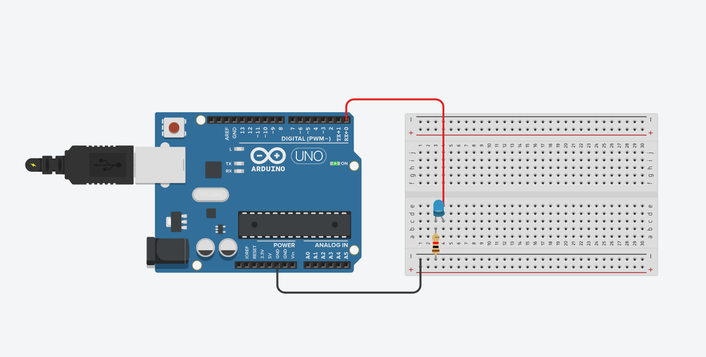

# M4_arduino

# Parte 1: Blink Led Interno
 **Tarefa:** azer o led interno do arduino ficar aceso por um tempo X, apagar e aguardar Y segundos e depois voltar a acender, propondo um loop que gera uma "luz piscando".

 Primeiro, abri o Arduino IDE, criei um novo sketch e em seguida, escrevi o seguinte código:

 ```cpp
void setup() {
  pinMode(LED_BUILTIN, OUTPUT); //configura o LED interno como saída
}

void loop() {
  digitalWrite(LED_BUILTIN, HIGH); //acende o LED
  delay(1000); //espera por 1 segundo
  digitalWrite(LED_BUILTIN, LOW); //apaga o LED
  delay(1000); //espera por 1 segundo
}
```
Depois de escrever o código, conectei o Arduino ao computador usando um cabo USB. Selecionei a placa (Arduino Uno) e a porta COM correspondente no Arduino IDE. Por fim, cliquei no botão "Upload" para enviar o código para o Arduino e assim o Arduino executou o código e o LED interno começou a piscar de acordo com o código. 

<p align="center"> <b>Vídeo de demonstração — Blink LED Interno</b><br> </img> </p>

# Parte 2: Simulando Blink Externo
**Tarefa:** Fazer uma simulação no TinkerCad com uma montagem do pisca-pisca com Arduino Uno. Ao clicar no play do TinkerCad, o projeto deve executar sem erros uma rotina que simula um pisca-pisca de qualquer cadência. Utilize no projeto um protoboard, ligações elétricas, LED (precisa ser um OFF_BOARD), resistor e um Arduino.

Para simular o pisca-pisca no TinkerCad utilizei:
- 1 protoboard (Base para montar circuitos sem precisar soldar);
- 1 LED (Emite luz quando a corrente elétrica passa por ele);
- 1 resistor (Limita a passagem de corrente elétrica no circuito);
- 2 jumpers (Fios que conectam componentes na protoboard);
- 1 Arduino Uno (Placa que controla e executa circuitos eletrônicos programados);

Segui os seguintes passos:
1. Coloquei o Arduino Uno e o protoboard na área de trabalho do TinkerCad.
2. Conectei um jumper do GND do Arduino a linha negativa do protoboard.
3. Adicionei um resistor da linha negativa do protoboard a mesma coluna onde o LED será conectado.
4. Adicionei o LED na mesma coluna do resistor com o lado do catodo alinhado com o resistor.
5. Conectei outro jumper do pino 0 do Arduino a mesma coluna do anodo do LED.
6. Escrevi o seguinte código no editor de código do TinkerCad:
```cpp
void setup()
{
  pinMode(0, OUTPUT); //configura o LED como saída
}

void loop()
{
  digitalWrite(0, HIGH); //acende o LED
  delay(1000); //espera por 1 segundo
  digitalWrite(0, LOW); //apaga o LED
  delay(1000); //espera por 1 segundo
}
```
7. Cliquei no botão "play" para executar o projeto e o LED começou a piscar de acordo com o código.

<p align="center"> <b>Imagem do projeto no TinkerCad</b><br>  </p>

**Link para o projeto no TinkerCad:** [Clique aqui para acessar](https://www.tinkercad.com/things/aVaIb6jDGaC-blink-led?sharecode=5b_GEjejEvX6Q9PJz7XOICYwau7d4rUppCxpHw252rg)

Também reproduzi o projeto criado no tinkercad no hardware, ficando assim:

<p align="center"> <b>Vídeo de demonstração — Blink LED Externo (protoboard)</b><br> </img> </p>
